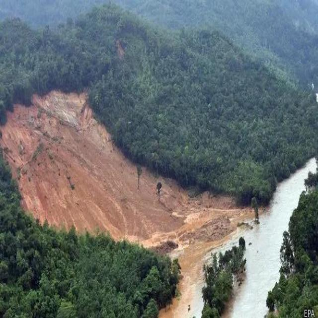
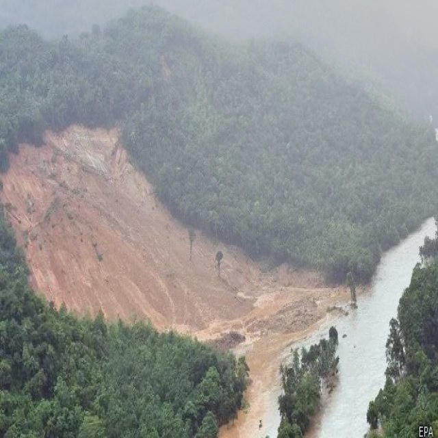

# MHG-DS: Multi-Hazard Geological Disaster Segmentation Dataset

MHG-DS is a binary segmentation dataset for unified geological hazard recognition in remote sensing images. It contains three representative hazard types: landslides, collapses, and cracks.

## Task Definition

All hazard regions, including landslides, collapses, and cracks, are labeled as foreground. Non-hazard areas are labeled as background.

## Dataset Examples

| Clear Image | Hazy Image | Mask |
| --- | --- | --- |
|  |  |  |
|  |  |  |
|  |  |  |

## Dataset Statistics

| Item | Number |
| --- | --- |
| Total images | 1921 |
| Training set | 1361 |
| Validation set | 285 |
| Test set | 275 |
| Classes | background, hazard |
| Hazard types | landslide, collapse, crack |

## Download

The full dataset is not publicly released yet. Several representative samples are provided in the `samples/` folder.

## Citation

```bibtex
@article{your2026shcfnet,
  title={SHCFNet: Adaptive Complementary Feature Fusion Network for Unified Multi-Type Geological Hazard Recognition in Hazy Remote Sensing Images},
  author={Your Name},
  journal={IEEE Transactions on Geoscience and Remote Sensing},
  year={2026}
}
